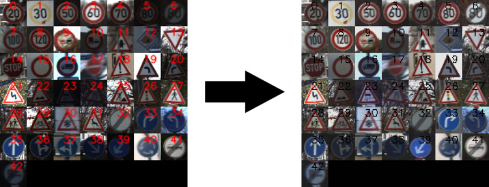
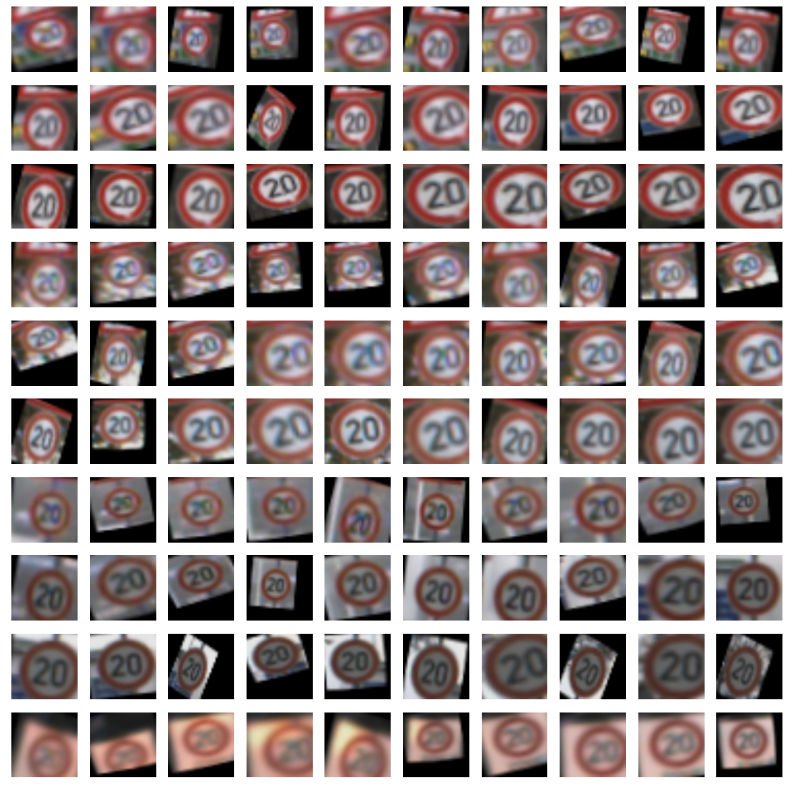
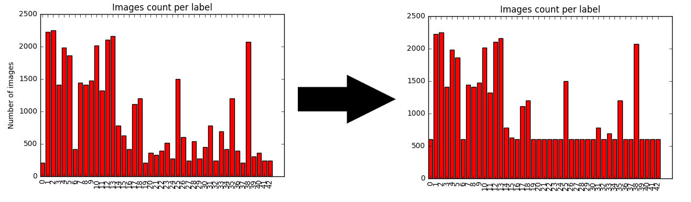
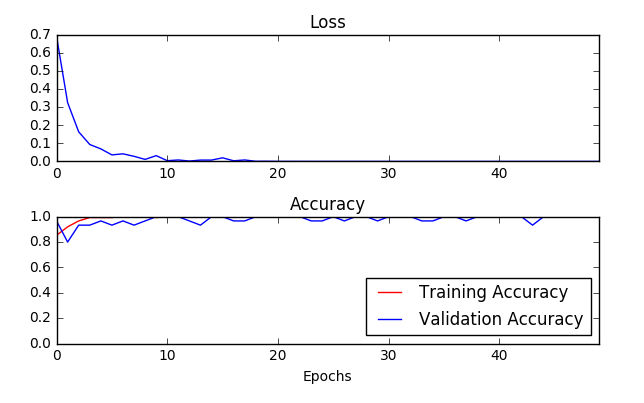

# Udacity Self-Driving Car Engineer Nanodegree

**Deep Learning**

**Project: Build a Traffic Sign Recognition Program**

## Overview

My neural network model trained to decode traffic signs from natural images by using the [German Traffic Sign Dataset](http://benchmark.ini.rub.de/?section=gtsrb&subsection=dataset).

[Click here to see full source code with visualizations in Jupyter notebook!](https://github.com/karolmajek/TrafficSignsRecognition/blob/master/Traffic_Signs_Recognition.ipynb)

## Dataset




1. [Download the dataset](https://d17h27t6h515a5.cloudfront.net/topher/2016/November/581faac4_traffic-signs-data/traffic-signs-data.zip). This is a pickled dataset in which we've already resized the images to 32x32.
2. Original notebook from Udacity:
```
git clone https://github.com/udacity/CarND-Traffic-Signs
cd CarND-Traffic-Signs
jupyter notebook Traffic_Signs_Recognition.ipynb
```

## Data augmentation

I have used [Vivek Yadav's](https://medium.com/@vivek.yadav/dealing-with-unbalanced-data-generating-additional-data-by-jittering-the-original-image-7497fe2119c3#.332anihuv) transform image function. It applies random affine transformation using angle,shear and translation ranges.
Here is sample what generated images look like



**Images count per label after adding generated images**



## Training



## Results on new data


## Dependencies

This project requires **Python 3.5** and the following Python libraries installed:

- [Jupyter](http://jupyter.org/)
- [NumPy](http://www.numpy.org/)
- [SciPy](https://www.scipy.org/)
- [scikit-learn](http://scikit-learn.org/)
- [TensorFlow](http://tensorflow.org)
- [Matplotlib](http://matplotlib.org/)
- [Pandas](http://pandas.pydata.org/) (Optional)

## Details and implementation

[Click here to see full source code with visualizations in Jupyter notebook!](https://github.com/karolmajek/TrafficSignsRecognition/blob/master/Traffic_Signs_Recognition.ipynb)
